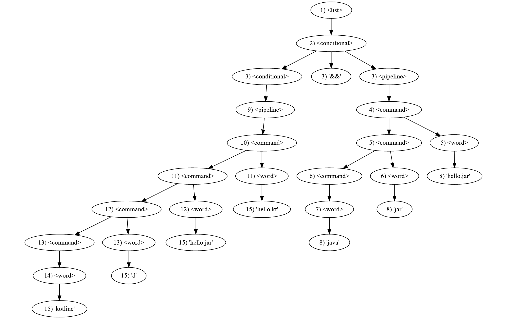
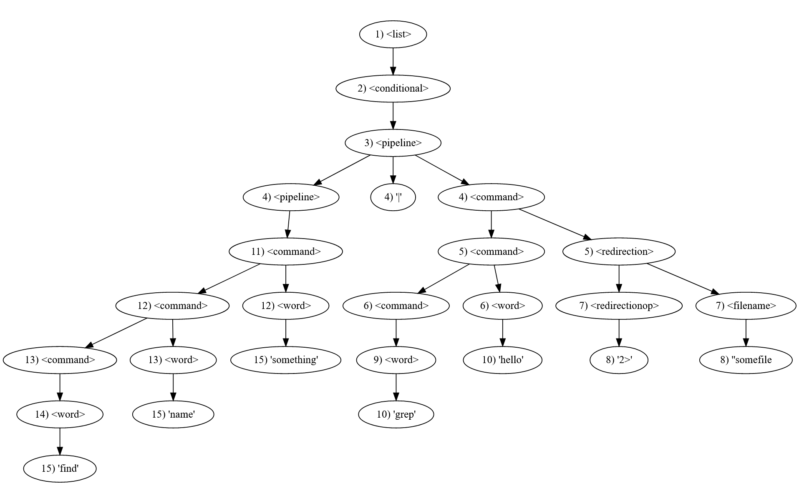

# Assignment 6 #

## Kotlin #

### *Nathan Rowley - CSCI320 - 2 March 2023* #

## *Part 2: Syntax Processing* # 
**2a.**

kotlinc d hello.jar hello.kt && java jar hello.jar  

Derivation:

| Line | Production | Result                                                                                                |
|:-----|:----------:|:------------------------------------------------------------------------------------------------------|
| 1    |    (1)     | list                                                                                                  |
| 2    |    (2)     | conditional                                                                                           |
| 3    |    (3)     | conditional "&&" pipeline                                                                             |
| 4    |    (4)     | conditional "&&" command                                                                              |
| 5    |    (5)     | conditional "&&" command word                                                                         |
| 6    |    (5)     | conditional "&&" command word word                                                                    |
| 7    |    (5)     | conditional "&&" word word word                                                                       |
| 8    |    (5)     | conditional "&&" word="java" word="jar" word="hello.jar"                                              |
| 9    |    (3)     | pipeline "&&" word="java" word="jar" word="hello.jar"                                                 |
| 10   |    (4)     | command "&&" word="java" word="jar" word="hello.jar"                                                  |
| 11   |    (5)     | command word "&&" word="java" word="jar" word="hello.jar"                                             |
| 12   |    (5)     | command word word "&&" word="java" word="jar" word="hello.jar"                                        |
| 13   |    (5)     | command word word word "&&" word="java" word="jar" word="hello.jar"                                   |
| 14   |    (5)     | word word word word "&&" word="java" word="jar" word="hello.jar"                                      |
| 15   |    (5)     | word="kotlinc" word="d" word="hello.jar" word="hello.kt" "&&" word="java" word="jar" word="hello.jar" |

AST:



Graphviz DOT Code:
```
digraph Graph2a {
    "1) <list>" -> "2) <conditional>"
    "2) <conditional>" -> {"3) <conditional>" "3) '&&'" "3) <pipeline>"}
    "3) <pipeline>" -> "4) <command>"
    "4) <command>" -> {"5) <command>" "5) <word>"}
    "5) <command>" -> {"6) <command>" "6) <word>"}
    "6) <command>" -> "7) <word>"
    "7) <word>" -> "8) 'java'"
    "6) <word>" -> "8) 'jar'"
    "5) <word>" -> "8) 'hello.jar'"
    "3) <conditional>" -> "9) <pipeline>"
    "9) <pipeline>" -> "10) <command>"
    "10) <command>" -> {"11) <command>" "11) <word>"}
    "11) <command>" -> {"12) <command>" "12) <word>"}
    "12) <command>" -> {"13) <command>" "13) <word>"}
    "13) <command>" -> "14) <word>"
    "14) <word>" -> "15) 'kotlinc'"
    "13) <word>" -> "15) 'd'"
    "12) <word>" -> "15) 'hello.jar'"
    "11) <word>" -> "15) 'hello.kt'"
}
```


**2b.**

find name something <code>&#124;</code> grep hello 2> somefile 

Derivation:

| Line | Production | Result                                                                                                                          |
|:-----|:----------:|:--------------------------------------------------------------------------------------------------------------------------------|
| 1    |    (1)     | list                                                                                                                            |
| 2    |    (2)     | conditional                                                                                                                     |
| 3    |    (3)     | pipeline                                                                                                                        |
| 4    |    (4)     | pipeline "<code>&#124;</code>" command                                                                                          |
| 5    |    (5)     | pipeline "<code>&#124;</code>" command redirection                                                                              |
| 6    |    (5)     | pipeline "<code>&#124;</code>" command word redirection                                                                         |
| 7    |    (6)     | pipeline "<code>&#124;</code>" command word redirectionop filename                                                              |
| 8    |    (6)     | pipeline "<code>&#124;</code>" command word redirectionop="2>" filename="somefile"                                              |
| 9    |    (5)     | pipeline "<code>&#124;</code>" word word redirectionop="2>" filename="somefile"                                                 |
| 10   |    (5)     | pipeline "<code>&#124;</code>" word="grep" word="hello" redirectionop="2>" filename="somefile"                                  |
| 11   |    (4)     | command "<code>&#124;</code>" word="grep" word="hello" redirectionop="2>" filename="somefile"                                   |
| 12   |    (5)     | command word "<code>&#124;</code>" word="grep" word="hello" redirectionop="2>" filename="somefile"                              |
| 13   |    (5)     | command word word "<code>&#124;</code>" word="grep" word="hello" redirectionop="2>" filename="somefile"                         |
| 14   |    (5)     | word word word "<code>&#124;</code>" word="grep" word="hello" redirectionop="2>" filename="somefile"                            |
| 15   |    (5)     | word="find" word="name" word="something" "<code>&#124;</code>" word="grep" word="hello" redirectionop="2>" filename="somefile"  |

AST:



Graphviz DOT Code:
```
digraph Graph2b {
    "1) <list>" -> "2) <conditional>"
    "2) <conditional>" -> "3) <pipeline>"
    "3) <pipeline>" -> {"4) <pipeline>" "4) '|'" "4) <command>"}
    "4) <command>" -> {"5) <command>" "5) <redirection>"}
    "5) <command>" -> {"6) <command>" "6) <word>"}
    "5) <redirection>" -> {"7) <redirectionop>" "7) <filename>"}
    "7) <redirectionop>" -> "8) '2>'"
    "7) <filename>" -> "8) 'somefile'"
    "6) <command>" -> "9) <word>"
    "9) <word>" -> "10) 'grep'"
    "6) <word>" -> "10) 'hello'"
    "4) <pipeline>" -> "11) <command>"
    "11) <command>" -> {"12) <command>" "12) <word>"}
    "12) <command>" -> {"13) <command>" "13) <word>"}
    "13) <command>" -> "14) <word>"
    "14) <word>" -> "15) 'find'"
    "13) <word>" -> "15) 'name'"
    "12) <word>" -> "15) 'something'"
}
```

## *Part 3: Kotlin Programming* #

## Setup
Place the text file to be read inside of the same directory as the `hw6.kt` file.

To compile from the command line:

```
kotlinc hw6.kt -include-runtime -d hw6.jar
```

## Running

From the command line:

```
java -jar hw6.jar <name of text file>.txt
```

When prompted, enter initials to check against the map generated using the input file. 
To exit the program, press `cntl-d`

## Notes:
When pressing `cntl-d` to exit the program, the code threw an error. After some research, I was unable to find a real
solution to this problem, so a try/catch block is used.
